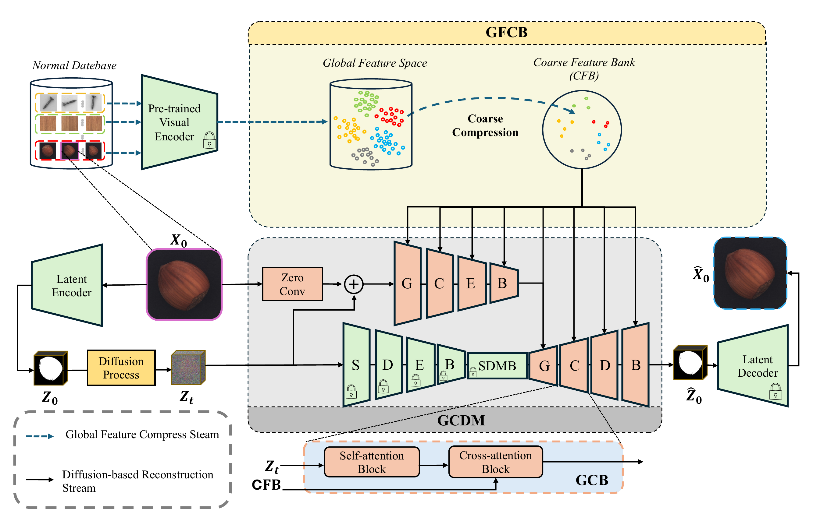

# CCAD


This repository is a reproduction of **DiAD (AAAI 2024)** and related CCAD experiments.
Original Paper: [DiAD: A Diffusion-based Framework for Multi-class Anomaly Detection](https://arxiv.org/abs/2312.06607)

## 📂 Repository Structure

- `train.py`: Main entry point for training and demo runs.
- `requirements.txt`: Python dependencies.
- `models/`: Directory for model checkpoints (pretrained weights should be placed here).
- `training/`: Directory for datasets (MVTec-AD, VisA).

## 🚀 Quick Start

### 1. Installation

Create a fresh environment:

```bash
conda create -n ccad python=3.8 -y
conda activate ccad
pip install -r requirements.txt
```

### 2. Data Preparation

Download the **MVTec-AD** dataset and organize it as follows:

```
training/
└── MVTec-AD/
    └── mvtec_anomaly_detection/
        ├── bottle/
        ├── cable/
        └── ...
```

Ensure `train.json` and `test.json` are present in `training/MVTec-AD/`.

### 3. Pretrained Models

This code requires pretrained weights. Please download:
- **Stable Diffusion v1.5** (`v1-5-pruned.ckpt`) -> Place in `models/`
- **Autoencoders** (if needed) -> Place in `models/`
- **CLIP ViT-L/14** (if running offline) -> Place in `models/clip-vit-large-patch14/`

*(Note: Large weights are ignored by git. You must download them manually.)*

### 4. Running the Demo

To start training/testing:

```bash
python train.py
```

